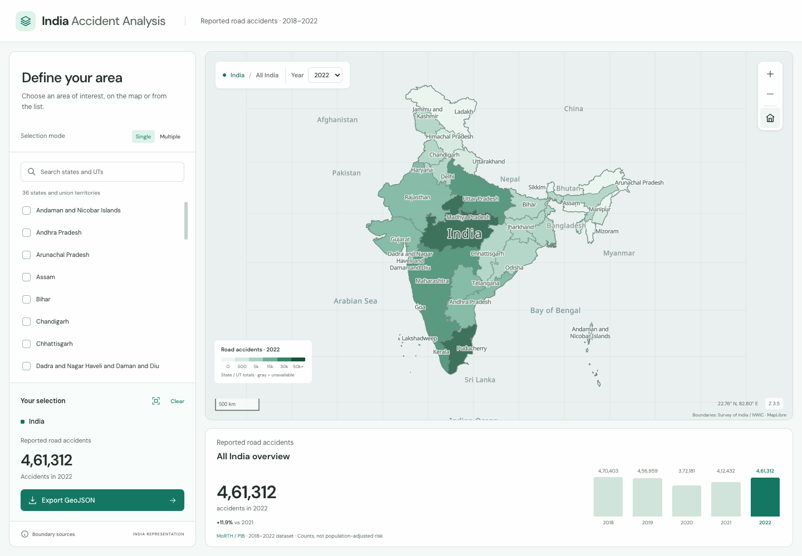

# India Accident Analysis

A reusable India GIS selection workspace built with React, MapLibre GL JS and Base UI. Map clicks and keyboard-accessible selection controls share the same feature IDs. The underlying primitives support country, state/union territory, district, or multiple areas; fit the selection and export GeoJSON with provenance.

[Open the app](https://chandanmahapatra.github.io/india-map-test/)



## Run

Use Node.js 22 or newer.

```sh
npm ci
npm run dev
npm test
npm run build
```

`npm run lint` checks formatting. `npm run preview` serves the build locally. For GitHub Pages, build with `BASE_PATH=india-map-test npm run build`. The existing deployment workflow uses the repository name as the base path and publishes `build/`. All boundary fetches respect Vite's base URL.

## Accident data

`static/accidents.json` is normalized from the existing `static/total_accidents.csv` with `python scripts/prepare-accidents.py`. Figures were checked against [MoRTH / PIB Annexure I](https://www.pib.gov.in/PressReleseDetailm.aspx?PRID=2042509). The script repairs the shifted Himachal Pradesh row, combines the pre-merger Dadra and Nagar Haveli / Daman and Diu rows, and excludes duplicate post-merger Daman entries. All five national totals reconcile. Jammu and Kashmir includes Ladakh in 2018–2020; separate Ladakh values remain unavailable for those years.

The map colors represent **state/UT accident counts**, not incident locations or population-adjusted risk. `accidentSummary` aggregates only the selected states, and treats missing values as unavailable. District accident totals are not supplied, so this app exposes state/UT selection only. The default is an All India overview; the map Home button and India breadcrumb restore it. The year picker sits beside the map breadcrumb and updates the map, selection total and chart together. The map guidance disappears after the first map interaction or state selection. State names use MapLibre symbol labels anchored to the geometry; hovering does not display a floating UI card. Clear removes the selection and returns the camera to the full India view. The current dataset ends in 2022 and is not presented as current-year data.

## Developer guide

The app shows reported road accident totals by state/UT for 2018–2022, with year selection, a national overview, selection summaries and GeoJSON exports. Developer documentation and kit details live here rather than in the app interface.

1. **Bring your boundaries:** configure stable IDs, names, parent IDs and provenance in the boundary manifest.
2. **Share selection state:** map clicks and Base UI controls update the same feature IDs across country, state and district levels.
3. **Reuse the geometry:** fit a selection or export GeoJSON with its source metadata.

## Interaction primitives

- `src/lib/aoi.js`: framework-independent geometry bounds, data normalization, ID-based selection, extent creation and export metadata.
- `src/lib/MapView.jsx`: MapLibre rendering with `fit(geometry)`, `home()`, `zoom(delta)`, `extent()` and `ready` exposed through a React ref.
- `src/App.jsx`: reference selection flow using Base UI Checkbox, ToggleGroup, Select, Input and Dialog. Every selection change fits the combined bounds of all selected areas. Changing selection levels returns the camera home. The selection summary shows accident counts and the selected year; its fit icon restores the selected extent.
- `src/app.css`: semantic surface/text tokens, restrained teal selection, responsive layout, focus states and reduced-motion behavior.

```js
const areas = normalizeCollection(geojson, source);
const selection = selectFeatures(areas, selectedIds);
const bbox = boundsOf(selection); // [west, south, east, north]
mapRef.current.fit(selection);
const exportData = exportSelection(selection, {
	level: source.id,
	representation: 'India',
	source
});
```

`boundsOf` traverses complete Polygon/MultiPolygon geometry, including islands and holes. It does not depend on currently rendered tiles. `normalizeCollection` requires nonempty area geometry, finite WGS84 coordinates, closed rings, names and unique IDs. Topological validity should be checked in the data preparation pipeline; client validation does not prove that polygons are free of crossings. `boundsOf` also supports GeometryCollection and other coordinate geometries. The simple bounding-box logic is designed for India; adapt it for AOIs crossing the antimeridian.

`extentFeature` creates a closed rectangle from ordered WGS84 bounds for developer integrations. The app does not expose an Extent tab or viewport capture controls. Extents are not clipped to India and can include water or neighboring territories. `exportSelection` retains the original features and adds an `aoi` foreign member containing level, representation, CRS, bounds, feature count and source provenance. Multiple selection exports individual features; it does not dissolve them.

## Bring your data

Configure `static/boundary-manifest.json` with country and state sources, and an optional district source. Each source supplies:

```json
{
	"id": "district",
	"label": "Districts",
	"url": "districts/{stateId}.geojson",
	"nameProperty": "name",
	"idProperty": "id",
	"parentProperty": "state_id",
	"provenance": {
		"name": "Your producer / publisher",
		"url": "https://example.org/source",
		"date": "Dataset vintage",
		"notes": "Known limitations and transformations"
	}
}
```

URLs resolve beneath the app's base path. Country and state data load in parallel after the manifest. Districts load only for the chosen state, with request cancellation, session caching and retry controls. District parent IDs must match state IDs. MapLibre `promoteId: 'aoi_id'` keeps hover identity aligned with UI selection. Avoid array-index IDs when replacing or reordering data. Add other administrative levels by reusing the adapter and defining their parent selection flow in the reference app.

## India's representation

The bundled state and district data come from the National Water Data Portal; their feature metadata identifies Survey of India as producer. All displayed administrative lines come from these local datasets. The country outline is derived from their state polygons, including the northern and eastern extent and islands. The map uses a local geometry-only style without a world political basemap. Review boundary and label layers before adding another basemap.

The snapshot contains 36 states/UTs and 733 source districts. The district snapshot is dated May 2025 and may omit subsequent reorganizations. These are generalized display geometries, not a certified survey product. See [boundary provenance](docs/boundary-provenance.md) for download links, source terms, coordinate conversion, hashes and the update policy.

## Verification

`npm test` checks geometry traversal, selection/export, invalid extent and ring input, snapshot counts, unique IDs, district parents and country/island extent. For independent topology checks, install the Python dependencies documented in the provenance guide, then run:

```sh
python scripts/verify-boundaries.py
```

When changing the integration, verify list and map selection, multiple mode, district scope switching while a request is pending, keyboard control, zoom, Fit India, Clear returning home, export, retry states, and the mobile layout. Geometry selection and export remain available if WebGL fails.

### Selection levels in other apps

`enabledLevels` in `src/App.jsx` limits this accident app to state/UT selection. The level control is hidden when only one level is enabled. Set `enabledLevels = ['state', 'district']` for applications with district observations: the existing Base UI level control, parent state dropdown, lazy district loading and selection/export flow remain available. Country selection uses `showAllIndia()` via the map Home control or India breadcrumb; these can also back a Country tab in another app. Supply data at the selected geographic level rather than allocating state totals to districts.

## Use this repository as a template

Fork or copy this repository to start an India GIS dashboard for another dataset: public facilities, crop statistics, environmental indicators, survey coverage or incident analysis. Keep the geometry and selection primitives, then replace the accident-specific adapter, legend, metrics and chart with your own domain views.

| Level      | UI pattern                                            | Required data                                                    |
| ---------- | ----------------------------------------------------- | ---------------------------------------------------------------- |
| Country    | Home/India breadcrumb, or a Country tab               | National observations and country geometry                       |
| State / UT | State tab, search and single/multiple selection       | Observations keyed by stable state IDs                           |
| District   | District tab with parent state dropdown               | District observations keyed by district IDs and parent state IDs |
| Custom AOI | Drawing or map-view action built with `extentFeature` | Spatial observations or an aggregation service                   |

The supplied level control uses Base UI ToggleGroup. It can be presented as tabs (use Base UI Tabs when each level has its own panel), with the same `changeLevel` callback: reset selected IDs and search, then return the map home. For a Country tab, extend `levelLabels`, route its change to `showAllIndia()` and use `allIndia` to identify its active state. Country selection is already available through the breadcrumb and Home button. Changing a parent state clears district selections before loading its children. Selection updates must share IDs with map features; automatically fit the complete selected geometry, including disconnected areas.

Join observations by IDs rather than display names. For district or custom AOI statistics, replace `accidentSummary` and `accidentMapCollection` with an adapter for that level; do not reuse state totals as district values. Keep unavailable data separate from zero, document years and aggregation rules, and retain provenance in exported GeoJSON. Geographic selection can also work independently of statistics.

### Labels and geographic context

`static/map-labels.geojson` contains one interior point per state/UT, plus approximate cartographic anchors for India, nearby countries and surrounding seas. Regenerate state anchors with `python scripts/prepare-labels.py` using Shapely. They are derived from the largest polygon component of each shipped state; MapLibre collision handling reveals small areas as you zoom. These context points introduce no foreign political boundary lines.

The local Noto Sans Regular Latin glyphs in `static/fonts/` were obtained from the MapLibre demo font service and are distributed under the included SIL Open Font License. Map labels, glyphs and boundary data are served from the app's own base path. When adding languages, bundle the additional font glyph ranges and translations; the included range supports the current English labels.

### Publish your copy on GitHub Pages

The workflow in `.github/workflows/main.yml` tests and builds pushes to `master`, then publishes `build/` to `gh-pages`. In repository Settings → Pages, select **Deploy from a branch**, branch **gh-pages**, folder **/ (root)**. If your default branch is `main`, change the workflow trigger accordingly. `BASE_PATH` comes from the repository name, so forks use their own project URL. For a root user site or custom domain, adjust the Vite base path. Update the README app link and screenshot for your copy.

To refresh the screenshot, run the app, restore All India with the Home button, choose a year and capture the complete desktop interface to `docs/screenshot.png`.
